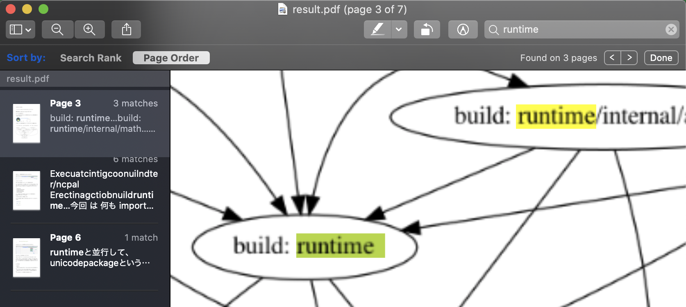

Jisui (自炊)
---

Jisui is a helper tool to create e-book.  
Ordinary the scanned book have not text information, so you cannot search text from the PDF.  
Jisui extract texts from a scanned book (PDF) and merge the text to PDF.

This tool is depending on Google Cloud Vision API to extract texts.  
So you need GCP account & own project.

[Jisui (自炊)](https://ja.wikipedia.org/wiki/%E8%87%AA%E7%82%8A_(%E9%9B%BB%E5%AD%90%E6%9B%B8%E7%B1%8D)) is Japanese slung which means that scanning a book to make e-book.

## Pre-requirements

* GCS bucket
* GCP credential file
* Font file e.g. https://moji.or.jp/ipafont/

## Install

```
$ go get github.com/sachaos/jisui
```

## Usage

```
$ jisui -bucket [your GCS bucket] -font [Downloaded font] -output result.pdf [scanned PDF file]
```

## Example

You can see example PDF file.

Please download and open it in PDF viewer.

You can recongnize the difference when you search text.

* [Scanned image PDF](./example/scanned.pdf)
* [Processed PDF](./example/result.pdf)


